# Architecture

MTGO Metagame Deck Builder is a wxPython desktop application for Windows that provides metagame research, deck building, opponent tracking, and collection management for Magic: The Gathering Online players.

## Architecture Overview

```mermaid
graph TB
    subgraph "Entry Point"
        MAIN[main.py<br/>MetagameWxApp]
    end

    subgraph "Controllers Layer"
        AC[AppController<br/>Central State & Coordination]
        ACH[app_controller_helpers.py]
        SM[SessionManager]
        MBGH[mtgo_background_helpers.py]
        BDH[bulk_data_helpers.py]
    end

    subgraph "UI Layer (wxPython Widgets)"
        AF[AppFrame<br/>Main Window]
        DRP[DeckResearchPanel]
        DBP[DeckBuilderPanel]
        CTP[CardTablePanel]
        CIP[CardInspectorPanel]
        SGP[SideboardGuidePanel]
        RP[RadarPanel]
        ODS[MTGOpponentDeckSpy<br/>Overlay Tracker]
        MH[MatchHistory]
        TA[TimerAlert]
    end

    subgraph "Services Layer"
        DS[DeckService]
        CS[CollectionService]
        SS[SearchService]
        IS[ImageService]
        StS[StoreService]
        RS[RadarService]
        MBS[MTGOBackgroundService]
        FCPS[FormatCardPoolService]
        DWS[DeckWorkflowService]
        BSC[BundleSnapshotClient]
        RSC[RemoteSnapshotClient]
    end

    subgraph "Repositories Layer"
        CR[CardRepository]
        DR[DeckRepository]
        MR[MetagameRepository]
        RR[RadarRepository<br/>SQLite]
        FCPR[FormatCardPoolRepository<br/>SQLite]
    end

    subgraph "Utilities"
        CD[card_data.py<br/>CardDataManager / MTGJson]
        CI[card_images.py<br/>Image Downloader]
        AC_CLASS[archetype_classifier.py]
        DECK[deck.py<br/>Deck Parser]
        MBC[mtgo_bridge_client.py]
        AIO[atomic_io.py]
        GP[gamelog_parser.py]
    end

    subgraph "Web Scrapers"
        MTG_GF[mtggoldfish.py]
        MTGODL[mtgo_decklists.py]
    end

    subgraph "External Bridge"
        BRIDGE[MTGOBridge.exe<br/>.NET 9.0 + MTGOSDK]
    end

    subgraph "External Data Sources"
        SCRYFALL[Scryfall API/CDN]
        MTGJSON[MTGJson Database]
        GOLDFISH[MTGGoldfish]
        MTGO_CLIENT[MTGO Client]
    end

    MAIN --> AC
    AC --> AF
    AC --> ACH
    AC --> SM
    AC --> MBGH
    AC --> BDH
    AF --> DRP
    AF --> DBP
    AF --> CTP
    AF --> CIP
    AF --> SGP
    AF --> RP
    AC --> ODS
    AC --> MH
    AC --> TA
    AC --> DS
    AC --> CS
    AC --> SS
    AC --> IS
    AC --> StS
    AC --> RS
    AC --> MBS
    DS --> DR
    DS --> CR
    SS --> CR
    SS --> FCPS
    CS --> CR
    RS --> RR
    MBS --> MR
    FCPS --> FCPR
    CR --> CD
    DR --> DECK
    MR --> AC_CLASS
    IS --> CI
    CS --> MBC
    MR --> MTG_GF
    MR --> BSC
    MR --> RSC
    MTG_GF --> GOLDFISH
    MTGODL --> MTGO_CLIENT
    CI --> SCRYFALL
    CD --> MTGJSON
    MBC --> BRIDGE
    BRIDGE --> MTGO_CLIENT

    classDef controller fill:#ff9999,stroke:#333,stroke-width:2px
    classDef service fill:#99ccff,stroke:#333,stroke-width:2px
    classDef repo fill:#99ff99,stroke:#333,stroke-width:2px
    classDef ui fill:#ffcc99,stroke:#333,stroke-width:2px
    classDef util fill:#cc99ff,stroke:#333,stroke-width:2px
    classDef external fill:#ffff99,stroke:#333,stroke-width:2px

    class AC,ACH,SM,MBGH,BDH controller
    class DS,CS,SS,IS,StS,RS,MBS,FCPS,DWS,BSC,RSC service
    class CR,DR,MR,RR,FCPR repo
    class AF,DRP,DBP,CTP,CIP,SGP,RP,ODS,MH,TA ui
    class CD,CI,AC_CLASS,DECK,MBC,AIO,GP util
    class SCRYFALL,MTGJSON,GOLDFISH,MTGO_CLIENT,BRIDGE external
```

## Layer Responsibilities

**Controllers**: Central coordination and state management via `AppController`. Helper modules (`app_controller_helpers`, `bulk_data_helpers`, `mtgo_background_helpers`, `session_manager`) handle specific subsystems to keep the main controller lean.

**Services**: Business logic. Collection is split into focused sub-modules (`collection_cache`, `collection_parsing`, `collection_ownership`, `collection_deck_analysis`, `collection_stats`, `collection_bridge_refresh`, `collection_exporter`). Radar, format card pool, and deck workflow each have their own service.

**Repositories**: Data access with caching. `DeckRepository` and `MetagameRepository` use JSON file caches. `RadarRepository` and `FormatCardPoolRepository` use SQLite. `CardRepository` wraps `CardDataManager` for the MTGJson atomic-cards index.

**UI/Widgets**: wxPython panels in `widgets/panels/`, dialogs in `widgets/dialogs/`, and standalone overlay windows (`MTGOpponentDeckSpy`, `MatchHistory`, `TimerAlert`).

**Utils**: Card data management (`card_data.py`, `card_images.py`), atomic I/O (`atomic_io.py`), archetype classification, gamelog parsing, mana icon rendering, and search filter helpers.

**Navigators**: `mtggoldfish.py` scrapes metagame data and deck lists. `mtgo_decklists.py` is currently disabled while that feature moves to a service/API.

**External Bridge**: .NET 9.0 application using MTGOSDK to read collection and match data directly from the running MTGO client.

## Data Flow

- **Metagame research**: MTGGoldfish scrape → `MetagameRepository` (JSON cache, stale-while-revalidate) → UI display. Remote bundle snapshots can bypass live scraping.
- **Deck building**: Card search via `SearchService` → `DeckService` parsing → `CardTablePanel` rendering
- **Collection sync**: MTGO Bridge → `CollectionService` → ownership marking across UI
- **Card images**: Scryfall bulk data + CDN → `ImageService` caching → display
- **Radar analysis**: Cached deck lists → `RadarService` aggregation → `RadarRepository` (SQLite) → `RadarPanel`
