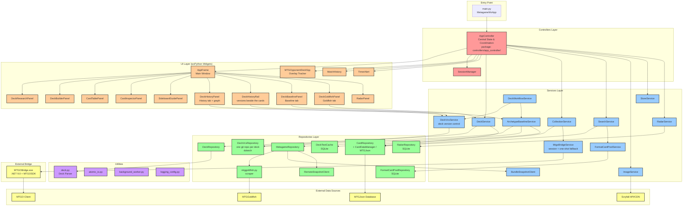

# Architecture

MTGO Tools is a wxPython desktop application for Windows that provides metagame research, deck building, opponent tracking, and collection management for Magic: The Gathering Online players.

## Architecture Overview


```mermaid
graph TB
    subgraph "Entry Point"
        MAIN[main.py<br/>MetagameWxApp]
    end

    subgraph "Controllers Layer"
        AC[AppController<br/>Central State & Coordination<br/>package: controllers/app_controller/]
        SM[SessionManager]
    end

    subgraph "UI Layer (wxPython Widgets)"
        AF[AppFrame<br/>Main Window]
        DRP[DeckResearchPanel]
        DBP[DeckBuilderPanel]
        CTP[CardTablePanel]
        CIP[CardInspectorPanel]
        SGP[SideboardGuidePanel]
        DHP[DeckHistoryPanel<br/>History tab + graph]
        DHR[DeckHistoryRail<br/>versions beside the cards]
        DBLP[DeckBaselinePanel<br/>Baseline tab]
        DGP[DeckGoldfishPanel<br/>Goldfish tab]
        RP[RadarPanel]
        ODS[MTGOpponentDeckSpy<br/>Overlay Tracker]
        MH[MatchHistory]
        TA[TimerAlert]
    end

    subgraph "Services Layer"
        DS[DeckService]
        CS[CollectionService]
        SS[SearchService]
        IS[ImageService]
        StS[StoreService]
        RS[RadarService]
        FCPS[FormatCardPoolService]
        DWS[DeckWorkflowService]
        DVS[DeckVcsService<br/>deck version control]
        ABS[ArchetypeBaselineService]
        BSC[BundleSnapshotClient]
        MBS[MtgoBridgeService<br/>session + one-shot fallback]
    end

    subgraph "Repositories Layer"
        CR[CardRepository<br/>+ CardDataManager / MTGJson]
        DR[DeckRepository]
        DVR[DeckVcsRepository<br/>one git repo per deck<br/>dulwich]
        DTC[DeckTextCache<br/>SQLite]
        MR[MetagameRepository]
        RR[RadarRepository<br/>SQLite]
        FCPR[FormatCardPoolRepository<br/>SQLite]
        MTG_GF[mtggoldfish.py<br/>scraper]
        RSC[RemoteSnapshotClient]
    end

    subgraph "Utilities"
        DECK[deck.py<br/>Deck Parser]
        AIO[atomic_io.py]
        BW[background_worker.py]
        LOG[logging_config.py]
    end

    subgraph "External Bridge"
        BRIDGE[MTGOBridge.exe<br/>.NET 9.0 + MTGOSDK]
    end

    subgraph "External Data Sources"
        SCRYFALL[Scryfall API/CDN]
        MTGJSON[MTGJson Database]
        GOLDFISH[MTGGoldfish]
        MTGO_CLIENT[MTGO Client]
    end

    MAIN --> AC
    AC --> AF
    AC --> SM
    AF --> DRP
    AF --> DBP
    AF --> CTP
    AF --> CIP
    AF --> SGP
    AF --> DHP
    AF --> DHR
    AF --> DBLP
    AF --> DGP
    AF --> RP
    AC --> ODS
    AC --> MH
    AC --> TA
    AC --> DS
    AC --> CS
    AC --> SS
    AC --> IS
    AC --> StS
    AC --> RS
    DS --> DR
    DS --> CR
    DHP --> DVS
    DHR --> DVS
    DBLP --> ABS
    DGP --> DS
    DWS --> DVS
    DWS --> ABS
    DVS --> DVR
    ABS --> DVR
    ABS --> MR
    ABS --> DTC
    SS --> CR
    SS --> FCPS
    CS --> CR
    RS --> RR
    FCPS --> FCPR
    DR --> DECK
    CS --> MBS
    MR --> MTG_GF
    MR --> BSC
    MR --> RSC
    MTG_GF --> GOLDFISH
    IS --> SCRYFALL
    CR --> MTGJSON
    MBS --> BRIDGE
    BRIDGE --> MTGO_CLIENT

    classDef controller fill:#ff9999,stroke:#333,stroke-width:2px
    classDef service fill:#99ccff,stroke:#333,stroke-width:2px
    classDef repo fill:#99ff99,stroke:#333,stroke-width:2px
    classDef ui fill:#ffcc99,stroke:#333,stroke-width:2px
    classDef util fill:#cc99ff,stroke:#333,stroke-width:2px
    classDef external fill:#ffff99,stroke:#333,stroke-width:2px

    class AC,SM controller
    class DS,CS,SS,IS,StS,RS,FCPS,DWS,DVS,ABS,BSC,MBS service
    class CR,DR,DVR,DTC,MR,RR,FCPR,MTG_GF,RSC repo
    class AF,DRP,DBP,CTP,CIP,SGP,DHP,DHR,DBLP,DGP,RP,ODS,MH,TA ui
    class DECK,AIO,BW,LOG util
    class SCRYFALL,MTGJSON,GOLDFISH,MTGO_CLIENT,BRIDGE external
```

## Layer Responsibilities

**Controllers**: Central coordination and state management via `AppController`. The controller is a package (`controllers/app_controller/`) composed of eight focused mixins (`card_data`, `archetypes`, `decks`, `collection`, `bulk_data`, `settings`, `updates`, `lifecycle`) plus a small `SessionManager` for per-run state and the non-mixin helpers beside them (`ui_callbacks`, `cache_warmer`). Each mixin owns one subsystem to keep the composed controller class lean.

**Services**: Business logic. Image, collection, and deck services are each Python packages whose main class inherits from (or composes) focused mixins/helpers. For example `services/collection_service/` contains `cache`, `parsing`, `ownership`, `deck_analysis`, `stats`, `bridge_refresh`, and `exporter` modules; `services/image_service/` splits into `bulk_data`, `metadata`, `printing_index`, `cache`, and `download_queue`; `services/deck_service/` contains `parser`, `averager`, and `text_builder`. Radar, format card pool, and deck workflow each have their own service. `services/deck_vcs_service.py` owns the decisions around deck version control — what a save is called in the history, when a decklist edited outside the app counts as a version already held, and which file on disk a checkout may rewrite — leaving git itself to `repositories/deck_vcs_repository/`; `DeckWorkflowService.save_deck` calls into it on every save, best effort, because the deck file is already on disk by then and a history problem must not be reported as a failed save. `services/deck_name.py` holds the deck's name as explicit state (empty means unset, and a name is always a legal file stem) rather than recomputing it per save from the deck record. `services/archetype_baseline_service/` measures what an archetype always runs: `membership` drops labelled decks that are not actually the archetype (mean pairwise Jaccard over card names, `MEMBERSHIP_THRESHOLD = 0.30`), `frequency` counts cards in one pass per deck, `classify` takes the strict intersection at each card's floor count with no tolerance at all, and `service` seeds a new deck's history with that baseline as a deterministic root commit, so "diff against the archetype" is an ordinary diff against an ancestor rather than a second concept. `services/collection_service/diff.py` answers the other half of ownership — the decklist of what is still missing, drawn against a per-name budget with mainboard before sideboard — and `services/deck_service/goldfish.py` holds the wx-free shuffling, mulligan bookkeeping and table state behind the Goldfish tab. `services/card_rarity_service.py` answers one question -- has this card name ever been printed at common? -- by deriving it from the Scryfall bulk file the image service already caches, because that is the only per-printing rarity source on disk and it is what `services/gamelog_service/formats.py` needs to recognise Pauper (the one MTGO format defined by rarity rather than by a card list, and therefore the one that legality data structurally cannot name). `services/archetype_model_service.py` builds the model `services/gamelog_service/archetypes.py` uses to name the archetype behind the few cards a game log shows: it joins the cached archetype list, deck index and deck texts, clusters per-archetype card profiles (merging labels the two naming sources spell differently) and scores samples against them, on a background worker at startup and again whenever the remote bundle refreshes the deck caches. `services/mtgo_bridge_service/` wraps the external CLI bridge, and its package facade exposes collection and trade snapshots, trade acceptance, and the challenge watcher. The transport underneath is `session.py`: one `MTGOBridge.exe serve` process kept alive for the life of the app, spoken to in newline-delimited JSON over stdin/stdout with request-id correlation, serialising every caller through one pipe and respawning transparently when the bridge dies or MTGO restarts. That exists because MTGOSDK's `RemoteClient` attach cost ~3.1s on top of ~0.8s of .NET startup *per command*, and because several bridge processes attached at once degraded per-call latency roughly 8x — MTGOSDK marshals every remote read onto MTGO's UI thread. `client.py` is the fallback, not the default: the one-shot subprocess transport the facade drops back to when no session can be established, most often an older bridge build with no `serve` mode, so behaviour is unchanged where a session is impossible. Setting `MTGO_BRIDGE_NO_SESSION` (`BRIDGE_SESSION_DISABLE_ENV`) to a truthy value disables the long-lived mode outright and puts every call back on the one-shot path.

**Repositories**: Data access with caching. `DeckRepository` and `MetagameRepository` use JSON file caches. `RadarRepository`, `FormatCardPoolRepository`, and `DeckTextCache` use SQLite. `CardRepository` is a single package that combines the collection-file repo with `CardDataManager`, owning the MTGJSON AtomicCards download, on-disk index format, and in-memory query API (`builder`, `remote`, `storage`, `schemas`, `card_data_manager`). `repositories/deck_vcs_repository/` is the only part of the app that touches git: one repo per deck under `DECK_HISTORY_DIR` (`BASE_DATA_DIR/deck_history`, a sibling of `config/` rather than a child of `cache/`, because the uninstaller and `scripts/clear_caches.py` both sweep `cache/` wholesale and a deck's edit history is the user's own work that nothing can rebuild), driven through `dulwich` and split into `store` (where a repo lives, and how a handle is opened and shared across a batch of reads), `commits`, `branches`, `diffs` and `baseline`. Three rules shape it: the user's real `.txt` never gains a `.git` neighbour — the repo is a mirror holding one normalized `deck.txt` — `HEAD` is never detached, so checking out a commit that is not already a branch tip creates a branch there first and no save can land unreachable, and there is no merging at all, which leaves the history a tree of chains and the graph layout with no rejoining edges to place. A deck's repo is found by the stable `deck_uuid` stamped onto its record the first time it is saved, so renaming a deck keeps its history and two decks that happen to share a name keep separate ones. `repositories/scrapers/` (`mtggoldfish.py`, `mtggoldfish_visual.py`) is the source side of `MetagameRepository` and `DeckTextCache`, and `repositories/remote_snapshot_client/` provides remote-bundle archetype/stats snapshots as a source for `MetagameRepository` — these data sources live under `repositories/` because owning a data source and shaping it into domain records is a repository's job, not a service's.

**UI/Widgets**: wxPython panels in `widgets/panels/`, dialogs in `widgets/dialogs/`, and standalone overlay windows (`MTGOpponentDeckSpy`, `MatchHistory`, `TimerAlert`). The deck workspace's tabs are panels of their own: `deck_history_panel/` paints the version graph (its lane assignment lives in a wx-free `layout` module, so the fork case is answered by a unit test rather than by a screenshot) beside a decklist and diff view, `deck_baseline_panel/` renders the archetype baseline as a tree, and `deck_goldfish_panel/` draws the hand and the table. `deck_history_rail/` is the same history a second time, as a narrow always-visible column between the deck tables and the inspector — the frame reads a deck's history once and hands the same snapshot to both, and the two differ only in what a click means: select in the tab, check out in the rail.

**Utils**: Cross-cutting helpers only — atomic I/O (`atomic_io.py`), deck text parsing (`deck.py`), background workers (`background_worker.py`), logging setup (`logging_config.py`), JSON helpers, perf timers, runtime flags, diagnostics, image effects, math, constants, and i18n. Single-consumer modules have been colocated with their callers: search filter helpers live in `services/search_service/`, image worker entrypoints and Scryfall bulk image downloading in `services/image_service/`, deck-results filtering in `widgets/panels/deck_research_panel/results_filter.py`, wx styling helpers in `widgets/stylize.py`, mana icon rendering in `widgets/mana_icon_factory/`, and small widget-specific helpers inside their respective `widgets/.../` packages. The MTGJSON atomic-cards dataset is owned by `repositories/card_repository/`, gamelog parsing by `services/gamelog_service/`, the deck-text SQLite cache by `repositories/deck_text_cache.py`, the MTGGoldfish scrapers by `repositories/scrapers/`, and the MTGO CLI bridge by `services/mtgo_bridge_service/`.

**External Bridge**: .NET 9.0 application using MTGOSDK to read collection and match data directly from the running MTGO client.

## Composition by Mixin

Most classes here that run past a page are assembled from mixins rather than written out in one file: 172 classes are named `*Mixin`, and 48 classes inherit from three or more bases. The extremes are worth stating plainly rather than hiding. `AppFrame` (`widgets/frames/app_frame/frame/__init__.py`) has **20 bases** — nineteen mixins and `wx.Frame`; `AutomationServer` has 13; `AppController` has 8; `MTGOpponentDeckSpyHandlersMixin` is itself a mixin built from seven more; `CollectionService`, `DeckBuilderPanel`, and `CardImageDisplay` have six each. Read as an inheritance hierarchy that is alarming, and a reader is right to flinch. It is not one: none of the 172 subclasses another to *specialise* it, none is ever instantiated, and none is used polymorphically — each is a flat namespace of methods that exactly one host class merges into itself. (Three do inherit from other mixins, but as the second-tier bundles described at the end of this section, not as specialisations.) `AppFrame` is a single object carrying the 227 methods its mixins contribute and the 63 attributes its protocol declares, spread across the 5,672 lines of `widgets/frames/app_frame/`. The mixins are units of *navigation*, not units of encapsulation, and everything below follows from that substitution.

The UI layer is where the shape is least optional. A `wx.Frame` subclass has to *be* a frame — the native window is created inside `wx.Frame.__init__`, and every wx API that takes a parent takes a `wx.Window` — so `AppFrame` inherits from `wx.Frame` however its own code is organised, and its handlers have to be reachable as attributes of that same instance. `AppFrame.__init__` binds `self.Bind(wx.EVT_CHAR_HOOK, self._on_hotkey)` against a method defined in `CardShortcutHandlers`; the three column-builder mixins wire thirty-five callbacks of the form `on_deck_selected=self.on_deck_selected` into child panels while constructing them; the coalescing timers are bound with the frame as owner. None of that is *impossible* under composition — wx will bind `helper.method` quite happily — but it changes what the frame is. Each helper needs a back-reference to the frame it drives, and every such reference can outlive the window, because wx destroys the C++ side on close while the Python objects live until the last reference drops. This app has already paid for that class of bug: `widgets/menu_bar/panel.py` carries the post-mortem of a "wrapped C/C++ object of type Button has been deleted" crash, and `docs/WXMSW_BEHAVIOUR.md` exists because wxMSW's behaviour has repeatedly not been what its documentation says. Keeping the methods on the frame holds the number of objects that can outlive the window at one, so "is this window still alive?" stays a single question instead of one per helper.

Below the widgets there is no wx constraint and the pattern is used anyway, for a weaker but still real reason: a service's mixins share mutable state that has no owner other than the service. `CollectionService`'s six mixins all read and write the same `_collection` dict and `_collection_loaded` flag; `AutomationServer` collects the `_handle_*` methods contributed by all thirteen of its mixins into one command-dispatch table. Delegation would give each of those either a back-reference to the service or a fourth object owning the state, in exchange for an encapsulation boundary no caller wants — `collection_service.get_owned_count(...)` is the API that should exist, and `collection_service.ownership.get_owned_count(...)` is not an improvement on it. Where that justification runs out the pattern should stop: `ExporterMixin` (`services/collection_service/exporter.py`) touches no instance state whatsoever and is a class only so that `export_to_file` lands on the service's public surface. That one is file-splitting with a class drawn around it, and it is the shape to avoid copying, not the template.

The `Protocol` classes exist because a mixin's `self` is otherwise untypeable. A mixin references attributes it does not define — `self.controller`, `self.zone_cards`, `self.main_table` — so a type checker reading the module in isolation has nothing to resolve them against. Thirty-five `protocol` modules answer that: `AppFrameProto` in `widgets/frames/app_frame/protocol.py` declares 63 attributes and 21 cross-mixin methods, and `AppControllerProto`, `CollectionServiceProto`, and their siblings do the same for their hosts. Each mixin picks the protocol up with one idiom, which gives the checker a real base while leaving the runtime MRO untouched:

```python
if TYPE_CHECKING:
    from widgets.frames.app_frame.protocol import AppFrameProto

    _Base = AppFrameProto
else:
    _Base = object
```

122 of the 172 mixins declare their protocol this way. The protocol module doubles as the only documentation the pattern has of the composed object's shape: it is the one file that answers "what does this thing actually hold?" without reading all nineteen mixins.

The second convention is that **no mixin defines `__init__`** — true of all 172, without exception. `AppFrameHandlersMixin` states the reason in its docstring: kept as a mixin with no `__init__` "so `AppFrame` remains the single source of truth for instance-state initialization". The consequence is that the MRO never has to be reasoned about at construction time. `super().__init__(...)` in `AppFrame` reaches `wx.Frame` and nothing in between; every attribute named in `AppFrameProto` is assigned in exactly one place, the host's constructor, and can be read in order. Cooperative multiple inheritance — the thing that makes MRO genuinely hard to reason about — is simply not in use, and the no-`__init__` rule is what keeps it out.

The costs are real and worth naming precisely, because a reader will find them anyway. Every mixin's methods and every attribute share one flat namespace, so two mixins choosing the same name silently shadow rather than collide, resolved by base order with no warning; across the six largest composites there are currently zero such collisions, but that is a property of the names chosen so far, not something the structure prevents. A reader inside `zone_editing.py` sees `self.main_table` and `self.zone_cards` with nothing in the file to say where either comes from — one is a widget built by `CenterPanelBuilderMixin`, the other a property on `AppFramePropertiesMixin` forwarding to the controller — and the protocol supplies the type but not the owner. There is no enforced contract between a mixin and its host: the `Protocol` base is a static check and only when the mixin remembers to declare it, so the fifty that do not (mostly small handler/properties pairs) are unchecked, and nothing at runtime objects to a mixin composed into a host missing half of what it assumes. A traceback through `AppFrame` names a class whose body is spread over nineteen files. These are the ordinary costs of trading encapsulation for navigability. The trade is deliberate, but it is a trade, not a free win.

The rules for adding one, as the existing code applies them: one subsystem per mixin, in its own module, named for the subsystem; no `__init__` and no state initialisation of any kind, since every attribute is born in the host's constructor; declare the package's `*Proto` as `_Base` under `TYPE_CHECKING` with the idiom above, and add any new shared attribute to that protocol in the same change; prefix method names by subsystem wherever a collision is plausible; and if the new code touches no host state, write a module-level function instead of a mixin. When a host's base list itself becomes hard to read, the established move is a second tier rather than a longer list — `MTGOpponentDeckSpyHandlersMixin` bundles seven subsystem mixins so that the frame it serves keeps a base list of five, and `CardInspectorPanelHandlersMixin` and `MetagameAnalysisHandlersMixin` do the same for three each.

`AppFrame` is the standing exception to that last rule, and this document should say so rather than let the number quietly grow. Deck version control added `DeckHistoryHandlers` and `DeckNameHandlers` straight onto the frame's base list, taking it from eighteen to twenty, because that is where every existing handler already was and a two-mixin subsystem did not feel like the moment to restructure the largest class in the app. The rule still applies to it — the eleven handler mixins that are really three subsystems (deck content and research, sideboard guide recording, card selection and inspection) are what a second tier would bundle — and the honest statement of the current state is that the list is now two past the point where the rule was written to bite.

## Data Flow

- **Metagame research**: MTGGoldfish scrape → `MetagameRepository` (JSON cache, stale-while-revalidate) → UI display. Remote bundle snapshots can bypass live scraping.
- **Deck building**: Card search via `SearchService` → `DeckService` parsing → `CardTablePanel` rendering
- **Collection sync**: MTGO Bridge → `MtgoBridgeService` → `CollectionService` → ownership marking across UI
- **Card images**: Scryfall bulk data + CDN → `ImageService` caching → display
- **Radar analysis**: Cached deck lists → `RadarService` aggregation → `RadarRepository` (SQLite) → `RadarPanel`
- **Deck version history**: Save deck → `DeckWorkflowService` writes the `.txt` → `DeckVcsService` commits it into that deck's git repo under `DECK_HISTORY_DIR/<deck_uuid>/` (`DeckVcsRepository`, dulwich) → `DeckHistoryPanel`'s graph and the `DeckHistoryRail` beside the cards. A checkout runs the other way: the repository hands back a version's text, the service writes it to the user's `.txt`, and the workspace reloads from that file.
- **Archetype baseline**: `MetagameRepository` deck records + `DeckTextCache` decklists → `ArchetypeBaselineService` (drop the decks that are not the archetype, count cards, take the strict intersection) → `DeckBaselinePanel`, and as the root commit a new deck's history is seeded with

## Development Environment

The project is **developed from WSL** but the application itself **runs on
Windows**: wxPython, the MTGO Bridge subprocess, the Scryfall image cache layout,
and the packaging/installer pipeline all target Windows. Linting, formatting,
type-checking, and most non-wx tests work in either environment, but the full
pytest suite is intended to run against the Windows-side Python interpreter
(where `wx` is installed) — from WSL this is invoked via the Windows interop
shim (`/init /mnt/c/Windows/System32/cmd.exe /c "pytest ..."`).
`scripts/run_tests_fast.py` runs the same split locally.

CI splits the suite across two `windows-latest` jobs so that every test runs
exactly once: **Tests (non-UI, parallel)** takes everything outside `tests/ui/`
across the runner's cores with `pytest-xdist` (`pytest -n auto`), and **Tests
(UI, serial)** takes the wx tests, which build real top-level windows and have
to run one at a time in one process. Each job runs the design-system guards of
issue #962 as a named first step and `--ignore`s exactly those files in its main
run; `tests/test_ci_guards.py` pins the two lists so they cannot drift apart. A
third job, **Live Network Tests**, hits real external services and runs only on
`workflow_dispatch`. The .NET build is also on `windows-latest`; lint, type
check, security scan and the compile check run on `ubuntu-latest`. See
`.github/workflows/ci.yml` and `.github/VALIDATION_QUICKSTART.md`.
