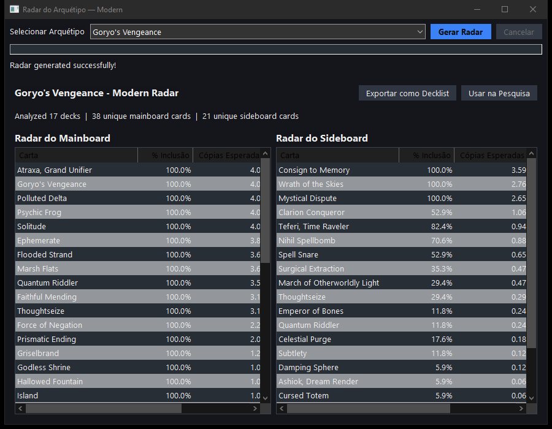
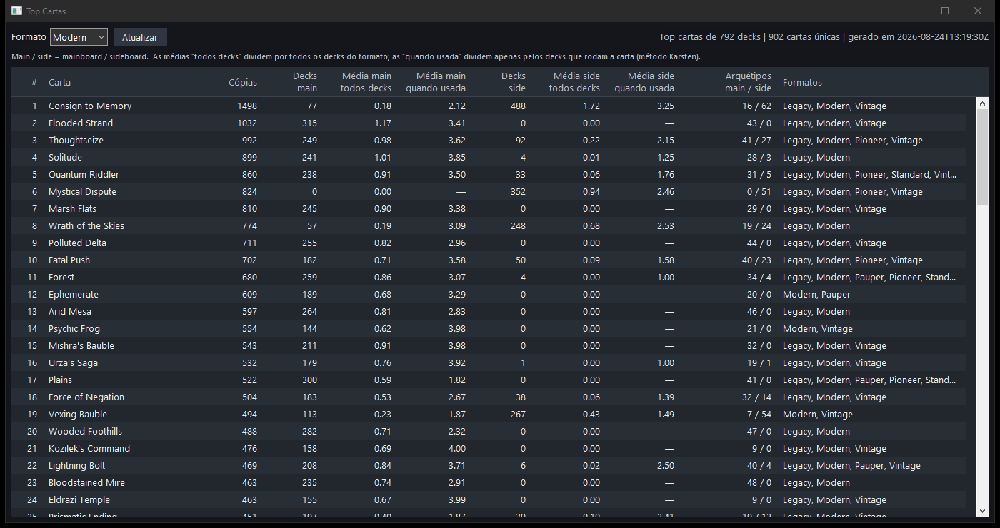
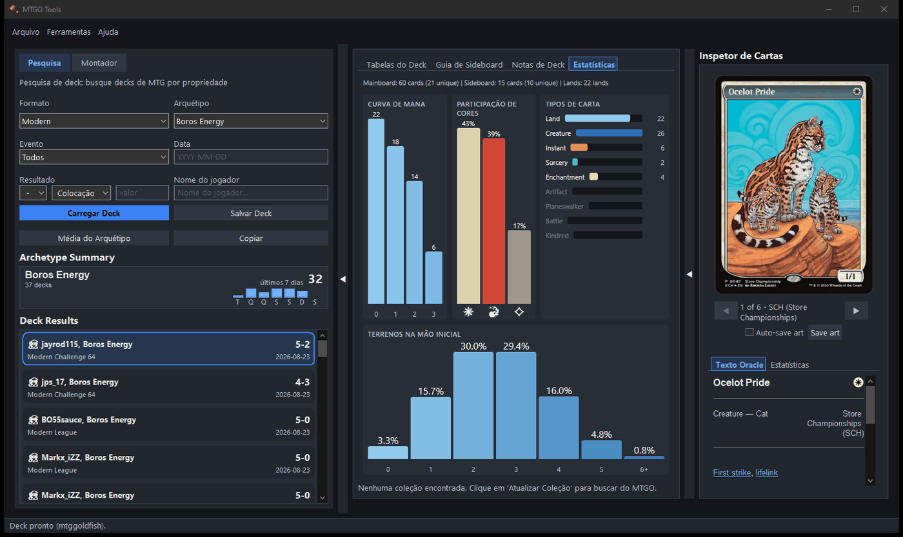

# MTGO Metagame Tools

Um aplicativo desktop para jogadores de Magic: The Gathering Online (MTGO) com análise de metagame, pesquisa de decks, rastreamento de oponentes e gerenciamento de coleção.


[English](README.md) · [Português (Brasil)](README.pt-BR.md)


## Funcionalidades

- **Análise de Metagame**: navegue pelos principais arquétipos do MTGGoldfish com taxa de vitória, popularidade e contagem de decks por dia. A visão de radar mostra a taxa de inclusão de cada carta nos decks de torneio recentes.
- **Pesquisa de Decks**: explore as listas de um arquétipo, importe do MTGGoldfish ou cole a lista direto, e veja a decklist média dos resultados recentes.
- **Montador de Deck**: busca completa de cartas com filtros de cor, tipo, custo de mana, texto de oracle e legalidade no formato. Estatísticas de curva de mana e indicação do que você já tem na coleção.
- **Rastreamento de Oponentes**: detecta o oponente automaticamente e busca as decklists recentes dele durante a partida.
- **Histórico de Partidas**: lê os game logs do MTGO para montar um histórico completo de partidas e estatísticas de taxa de vitória.
- **Guias de Sideboard**: crie e gerencie planos de sideboard por matchup, salvos por configuração de deck.
- **Gerenciamento de Coleção**: importe sua coleção do MTGO pelo .NET Bridge e veja quais cartas você tem ou está faltando para qualquer deck.
- **Alerta de Challenge**: avisa quando os challenges do MTGO estão prestes a começar.
- **Histórico de Versões**: cada vez que você salva um deck vira uma versão. Uma trilha ao lado das cartas lista todas elas, e a aba Histórico mostra o grafo, a diferença entre duas versões quaisquer e traz uma versão antiga de volta para a tela.
- **Baseline do Arquétipo**: uma aba Baseline para o deck que está na tela, separando o arquétipo entre as cartas que toda lista joga, as contagens que variam e os slots que são de fato seus, com os candidatos a flex ordenados por taxa de uso.
- **Goldfish**: compre uma mão inicial do mainboard, tome mulligan, compre cartas e baixe elas numa mesa.
- **Diferença para a Coleção**: salve o que o deck precisa e a sua coleção não tem como um arquivo de decklist, pronto para colar onde você compra, troca ou aluga cartas.
- **Checagem de Atualização**: Arquivo ▸ Verificar atualizações busca uma versão mais nova, confere o instalador contra o checksum publicado junto com ela e instala.


*Participação no metagame do formato e da janela de tempo escolhidos, com quem subiu e quem caiu em relação ao período anterior.*



*Radar: taxa de inclusão e cópias esperadas de cada carta que o arquétipo jogou, no mainboard e no sideboard.*



*Contagem de cartas do formato inteiro, com as médias "todos os decks" e "quando usada" no estilo Karsten.*


*Busca de cartas por nome, custo de mana, tipo, texto de oracle, identidade de cor e legalidade no formato.*



*Curva de mana, participação de cores, distribuição por tipo e probabilidade de terrenos na mão inicial, deck a deck.*

## Instalação

**Pré-requisitos**: Windows 10+, Python 3.11+, .NET 9.0 SDK (para o MTGO Bridge).

```bash
git clone https://github.com/Pedrogush/MTGO_Tools.git
cd MTGO_Tools
pip install -r requirements-dev.txt
python main.py
```

## Desenvolvimento

O desenvolvimento do dia a dia acontece no WSL, enquanto o alvo de execução do
app é o Windows (wxPython, bridge do MTGOSDK, empacotamento). Lint, formatação e
a maior parte dos testes rodam de boa dentro do WSL; a suíte completa do pytest
(incluindo os testes que dependem do wx) roda no Python do lado Windows, via
interop do WSL:

```bash
# Format and lint (WSL or Windows)
black .
ruff check --fix .

# Run tests on the Windows-side Python from WSL
/init /mnt/c/Windows/System32/cmd.exe /c "pytest"

# Or, from Windows directly
pytest

# The fast way: non-UI tests across the cores, UI tests alongside them
python scripts/run_tests_fast.py
```

O `pytest` sozinho continua rodando tudo em série, como sempre. As duas metades
se dividem do mesmo jeito que o CI divide: tudo que está fora de `tests/ui/` é
independente e roda sob `pytest-xdist` (`pytest -n auto --ignore=tests/ui`),
enquanto os testes de UI do wx criam janelas de verdade e rodam um de cada vez,
num processo só (`pytest tests/ui`). O `scripts/run_tests_fast.py` dispara as
duas ao mesmo tempo e imprime o resultado de cada uma. Não abra o app, nem uma
segunda rodada de UI, enquanto isso estiver acontecendo: os testes de UI
precisam da área de trabalho só para eles, e a proteção de dados reais quebra a
rodada se o app escrever em `config/` ou `cache/` nesse meio-tempo.

O CI instala as mesmas versões fixadas de `black`, `ruff` e `mypy` usadas
localmente, lendo o `requirements-dev.txt` — ou seja, `pip install -r
requirements-dev.txt` já te dá exatamente as versões que o CI roda. Veja
`.github/VALIDATION_QUICKSTART.md` para o fluxo de validação pré-commit que
espelha o CI (lint, formatação, compilação, segurança).

### Rodando no Linux / WSLg

O alvo de execução é o Windows, mas a UI é wxPython puro e roda sem nenhuma
alteração no GTK3, o que ajuda bastante a iterar em código de interface sem ter
que ir e voltar do Windows. O `scripts/run_linux.sh` prepara isso: o PyPI não
publica wheel de Linux para o wxPython, então ele instala uma do índice "extras"
do wxPython e ignora as dependências exclusivas do Windows (`pythonnet`,
`pyautogui`, `pynput` — elas só sustentam o bridge do MTGO e a automação de
tela, que precisam do cliente MTGO no Windows de qualquer jeito).

```bash
scripts/run_linux.sh --setup --fetch-libs   # one-time
scripts/run_linux.sh                        # launch
```

O `--fetch-libs` descompacta dentro do venv as bibliotecas de sistema contra as
quais a wheel do wx faz link, para quando você não tem root; com root,
`apt-get install libsdl2-2.0-0 libsm6 libnotify4 libpcre2-32-0` resolve. A
integração com o MTGO fica inerte aqui — o bridge precisa do cliente Windows —,
então isso serve para trabalhar na interface e nos dados, não em nada que toque
uma partida de verdade.

### Versionamento

As versões seguem [semver](https://semver.org) e são calculadas **depois que o
merge entra na `main`**, nunca no branch do PR. O workflow de release pega a tag
`vX.Y.Z` mais nova como base, lê os commits que vieram depois dela, escreve o
número resultante no arquivo `VERSION` da raiz do repositório — a única fonte da
verdade — e então cria a tag e publica um GitHub Release com o instalador já
construído.

A inferência sozinha nunca propõe mais do que um patch, então qualquer coisa
maior é você que pede: um trailer de git `Version-Bump: minor` (ou
`Release-As: 2.4.0`) em qualquer commit do intervalo, inclusive no commit de
merge. Escrever os títulos no padrão
[Conventional Commit](https://www.conventionalcommits.org) continua sendo o que
faz sair release: `feat:`, `fix:` e `perf:` geram release, o resto não. O
[`docs/VERSIONING.md`](docs/VERSIONING.md) tem as regras completas e os problemas
no histórico publicado que levaram a elas.

### CLI de automação

O pacote `automation` consegue abrir e controlar o app wxPython para checagens
manuais de UI e scripts E2E:

```bash
python -m automation.cli open-app --wait
python -m automation.cli ping
python -m automation.cli screenshot --path screenshots/current.png
python -m automation.cli screenshot --headless --path screenshots/background.png
python -m automation.cli close-app
```

O `screenshot --headless` se vira sozinho depois que o app está rodando com a
automação habilitada. Ele restaura temporariamente uma janela minimizada ou
escondida para fazer a captura e devolve ela ao estado anterior em seguida; o
próprio comando de screenshot não exige nenhum `cmd.exe` extra nem gerenciamento
manual de janela.

Veja `automation/README.md` para as opções de porta, as notas sobre interop com
WSL e o comportamento do `close-app`.

### Testes de GameLog / Histórico de Partidas

O `tests/test_gamelog_parser.py` faz o parsing dos arquivos de GameLog locais do MTGO e exige a variável de ambiente `MTGO_USERNAME`. Os scripts de ativação do venv definem ela automaticamente. Os testes são pulados quando nenhum diretório de GameLog é encontrado.

### Qualidade de código

- **Black**: formatação (linha de 100 caracteres) — obrigatório, o CI falha se houver diff
- **Ruff**: lint — obrigatório, o CI falha se houver erros
- **mypy**: checagem de tipos (modo permissivo) — **apenas informativo**; o CI
  reporta os achados mas não bloqueia merges enquanto a cobertura de tipos vai
  sendo melhorada aos poucos
- **Bandit**: lint de segurança — obrigatório, o CI falha se houver problemas
- **pip-audit**: varredura de vulnerabilidades nas dependências — informativo;
  audita explicitamente o `requirements.txt` e o `requirements-dev.txt`

As versões das ferramentas estão fixadas no `requirements-dev.txt`; a
configuração delas fica no `pyproject.toml`.

### Relatórios do repositório

Dois relatórios são gerados a partir da árvore de código inteira:

```bash
python scripts/generate_loc_report.py            # writes LOC_REPORT.md
python scripts/generate_dependency_diagrams.py   # writes docs/diagrams/graph.json + dependencies_level_*.svg
```

Nenhum dos dois é versionado na `main` nem na `develop`. Comitar eles fazia todo
branch dar conflito e quebrar a verificação de atualidade, então eles moram num
branch só deles: o workflow `Refresh Generated Reports`
(`.github/workflows/refresh-reports.yml`) reconstrói o `automated/reports` a
partir do branch padrão atual, regenera os dois relatórios em cima dele e
força o push — uma vez por dia, e sob demanda pela aba Actions. Nada volta por
merge, então é no `automated/reports` que você lê os relatórios: ele é sempre a
`main` mais os relatórios da última rodada.

Rode os scripts localmente quando quiser (os dois aceitam `--check` para
detectar defasagem), mas deixe a saída sem comitar — esses arquivos são do
workflow.

## Estrutura do projeto

```
├── main.py                            # Ponto de entrada (MetagameWxApp)
├── controllers/                       # Coordenação da aplicação
│   ├── app_controller/                # Pacote AppController (mixins: lifecycle,
│   │                                  # archetypes, decks, collection, bulk_data,
│   │                                  # card_data, settings, ui_callbacks)
│   └── session_manager.py
├── widgets/                           # Interface wxPython
│   ├── frames/                        # Janela principal + frames independentes
│   │   ├── app_frame/                 # Janela principal
│   │   ├── match_history/             # Visualizador do histórico de partidas
│   │   ├── metagame_analysis/         # Frame de análise de metagame
│   │   ├── radar/                     # Frame de análise de radar
│   │   ├── identify_opponent/         # Identificação de oponente
│   │   └── ...                        # splash, rules_browser, top_cards, etc.
│   ├── panels/                        # DeckResearchPanel, DeckBuilderPanel, etc.
│   ├── dialogs/                       # Diálogos modais (feedback, ajuda, tutorial, ...)
│   ├── buttons/                       # Widgets de botão customizados
│   ├── lists/                         # Widgets de lista/grade
│   ├── mana_icon_factory/             # Renderizador bitmap/SVG dos símbolos de mana + cache
│   └── stylize.py                     # Helpers de estilização do wx
├── services/                          # Regras de negócio
│   ├── deck_service/                  # Parsing, médias, montagem de texto
│   ├── collection_service/            # Cache, parsing, posse, estatísticas, exportação
│   ├── search_service/                # Busca básica/montador/deck, filtros, mana
│   ├── image_service/                 # Bulk data, metadados, cache, fila de download
│   ├── radar_service/                 # Agregação do radar + snapshots pré-computados
│   ├── gamelog_service/               # Descoberta e parsing dos game logs do MTGO
│   ├── mtgo_bridge_service/           # Fachada Python + transporte para o bridge .NET
│   ├── bundle_snapshot_client/        # Cliente HTTP do snapshot remoto de bundle
│   ├── archetype_baseline_service/    # Staples, staples parciais e slots flex do arquétipo
│   ├── format_card_pool_service.py    # Cache do pool de cartas do formato
│   ├── archetype_resolver.py          # Normalização dos nomes de arquétipo
│   ├── card_service.py                # Fachada de consulta de cartas
│   ├── deck_workflow_service.py       # Fluxo de salvar/carregar deck
│   ├── deck_vcs_service.py            # Histórico de versões: o que um save registra
│   ├── deck_name.py                   # O nome do deck, e o histórico que ele indexa
│   ├── metagame_service.py            # Consultas de metagame
│   ├── comp_rules_service.py          # Texto das regras completas
│   └── store_service.py               # Persistência do estado do app
├── repositories/                      # Acesso a dados
│   ├── card_repository/               # MTGJSON atomic-cards + arquivos de coleção
│   ├── deck_repository/               # Banco de decks + filesystem + estado da UI
│   ├── deck_vcs_repository/           # Versões, branches e diffs de deck em git
│   ├── metagame_repository/           # Cache de arquétipos/decks (JSON)
│   ├── radar_repository/              # Snapshots do radar (SQLite)
│   ├── format_card_pool_repository/   # Pools de formato (SQLite)
│   ├── remote_snapshot_client/        # Buscador do snapshot remoto de bundle
│   ├── scrapers/                      # Scrapers do MTGGoldfish (texto + visual)
│   └── deck_text_cache.py             # Cache SQLite do texto dos decks
├── utils/                             # Helpers transversais
│   ├── atomic_io.py                   # Escrita atômica de arquivos
│   ├── deck.py                        # Helpers de parsing de texto de deck
│   ├── background_worker.py           # Helpers de thread pool
│   ├── image_effects.py               # Efeitos de imagem com PIL
│   ├── json_io.py                     # Helpers de leitura/escrita de JSON
│   ├── logging_config.py              # Configuração de logging
│   ├── math_utils.py                  # Helpers numéricos
│   ├── perf.py                        # Timers de performance
│   ├── runtime_flags.py               # Feature flags de runtime
│   ├── diagnostics.py                 # Dumps de diagnóstico
│   ├── find_opponent_names.py         # Helper de OCR do nome do oponente
│   ├── constants/                     # Constantes compartilhadas
│   └── i18n/                          # Helpers de tradução
├── dotnet/MTGOBridge/                 # Bridge .NET (MTGOSDK)
├── automation/                        # CLI de automação, servidor e helpers de E2E
├── scripts/                           # Scripts de manutenção (relatórios de LOC + grafo de dependências, etc.)
└── tests/                             # Suíte de testes do pytest
```

## MTGO Bridge

Um componente .NET 9.0 que lê os dados de coleção e de partidas do cliente MTGO em execução usando o MTGOSDK.

```bash
cd dotnet/MTGOBridge && dotnet build
```

O MTGO precisa estar aberto para usar os recursos de importação de coleção.

O app mantém um processo do bridge vivo durante a sessão e manda os comandos
para ele pela stdin, em vez de abrir um a cada comando: anexar ao cliente do
MTGO custa vários segundos toda vez, e vários bridges anexados ao mesmo tempo
atrapalham uns aos outros. Definir `MTGO_BRIDGE_NO_SESSION=1` volta para o
caminho antigo, de um processo por comando. O `dotnet/MTGOBridge/README.md`
documenta o protocolo.

## Fontes de dados

- **Dados de metagame**: [MTGGoldfish](https://www.mtggoldfish.com/)
- **Dados de cartas**: banco atomic-cards do [MTGJson](https://mtgjson.com/)
- **Imagens de cartas**: bulk data + CDN da Scryfall
- **Integração com o MTGO**: [MTGOSDK](https://github.com/videre-project/MTGOSDK)

## Licença

MIT — veja o arquivo LICENSE.
